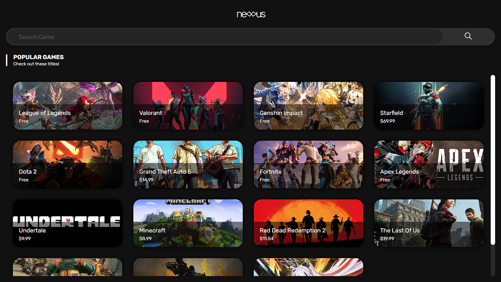
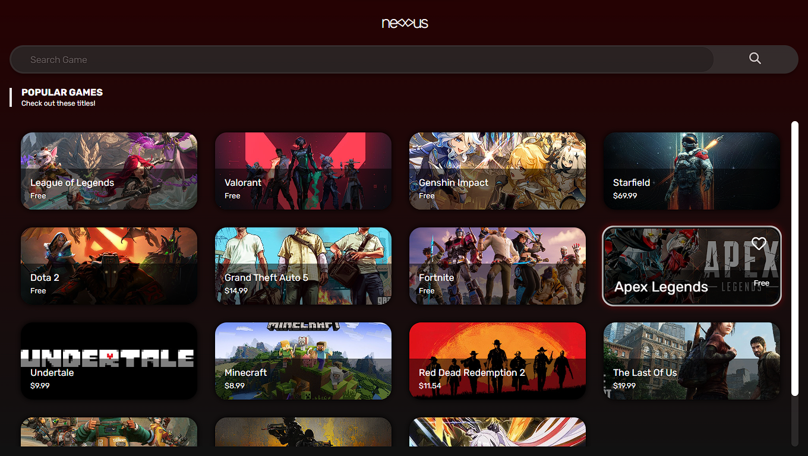
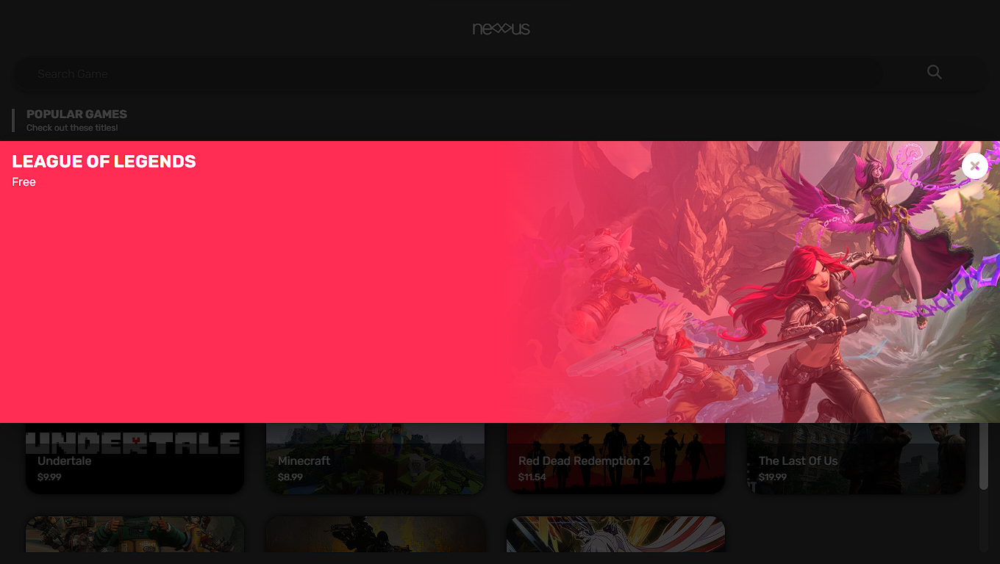
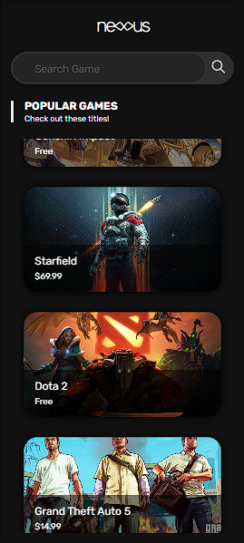
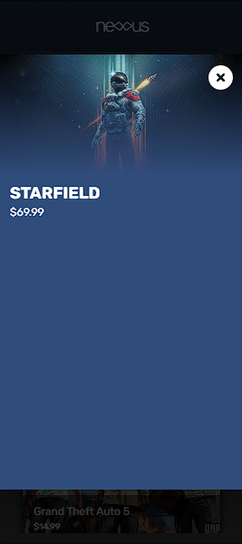

# Nexus

## About

A website containing some popular games, smooth searching, and some fun animations using React + TypeScript in Vite.

## Deployed on Firebase

Visit the website [here!](https://szy-kenn-nexus.web.app)

## Running on Local Machine

To run on your local machine, run the following commands:

```
git clone https://github.com/szy-kenn/nexus.git
cd nexus
npm run dev
```

and open the website on `localhost:5173`

## Screenshots

-   Landing Page



-   On Hover



-   On Click (can't think of anything to put here TT)



-   Responsive (Phone)



-   Responsive On Click (Phone)



-   And ofc a working search bar


